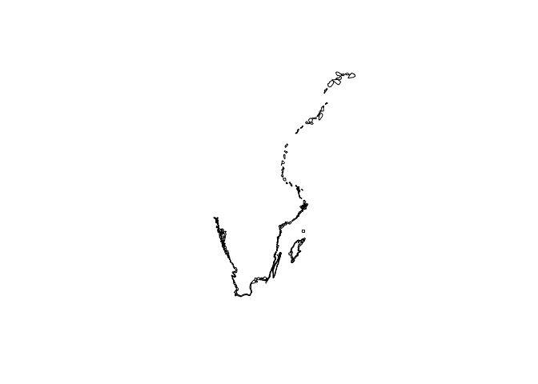
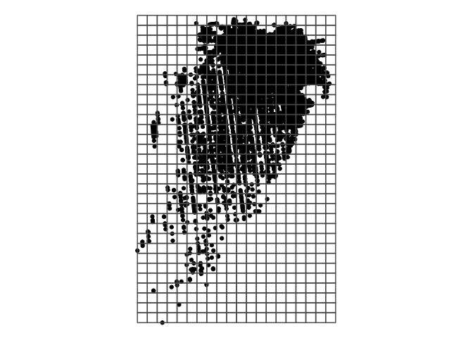

Aggregating data for HELCOM report
================

## Polygons

``` r
library(tidyverse)
library(sf)
polygons <- st_read("polygons/SEAL_polygons_c.shp")
```

    ## Reading layer `SEAL_polygons_c' from data source 
    ##   `/Users/martskol/ownCloud/Projects/HELCOM_seal_abundance22/polygons/SEAL_polygons_c.shp' 
    ##   using driver `ESRI Shapefile'
    ## Simple feature collection with 385 features and 1 field
    ## Geometry type: POLYGON
    ## Dimension:     XY
    ## Bounding box:  xmin: 10.75038 ymin: 55.31165 xmax: 24.15853 ymax: 65.78757
    ## Geodetic CRS:  WGS 84

``` r
polygons$geometry %>% plot()
```

<!-- -->

## Harbour seal

Harbour seals data downloaded from
[Sharkweb](https://sharkweb.smhi.se/hamta-data/) for 2003-2019 (short
column names, semi-colon separated with decimal comma, Windows
line-breaks and UTF-8 encoded).

``` r
harbour_sharkweb <- read_csv2("data/sharkweb_data_harbour2003-2019.txt", guess_max = Inf) %>% 
  filter(SCIENTIFIC_NAME == "Phoca vitulina") %>% 
  select(date = SDATE, station = REP_STATN_NAME, lat = LATIT_DD, lon = LONGI_DD, count = VALUE)
```

    ## Warning: One or more parsing issues, see `problems()` for details

``` r
harbour_corrected_coords <- readxl::read_excel("data/HS_corrected_coords.xlsx") %>% 
  mutate(date = as.Date(date))
harbour_new <- readxl::read_excel("data/HS2020-2021_to_HELCOM.xlsx") %>% 
  mutate(date = as.Date(paste(YEAR, MONTH, DAY, sep = "-"))) %>% 
  select(date, station = Stationsnamn, lat = LATDD, lon = LONGDD, count = HS_COUNT)
harbour_data <- bind_rows(harbour_sharkweb %>% 
                            filter(!(paste(date, station) %in% paste(harbour_corrected_coords$date, harbour_corrected_coords$station))), 
                          harbour_corrected_coords,
                          harbour_new)
```

``` r
harbour_spatial <- harbour_data %>%  
  st_as_sf(coords = c("lon", "lat"), remove = FALSE) %>% 
  st_set_crs("+proj=longlat +datum=WGS84") %>% 
  st_join(polygons)
```

The following data are not contained in any polygon

``` r
harbour_spatial %>% filter(is.na(id)) 
```

    ## Simple feature collection with 0 features and 6 fields
    ## Bounding box:  xmin: NA ymin: NA xmax: NA ymax: NA
    ## CRS:           +proj=longlat +datum=WGS84
    ## # A tibble: 0 × 7
    ## # … with 7 variables: date <date>, station <chr>, lat <dbl>, lon <dbl>,
    ## #   count <dbl>, geometry <GEOMETRY [°]>, id <dbl>

Aggregating over polygons

``` r
harbour_aggregated <- harbour_spatial %>% 
  filter(!is.na(id)) %>% 
  mutate(center = st_centroid(geometry),
         c_lon = st_coordinates(center)[1],
         c_lat = st_coordinates(center)[2]) %>% 
  as_tibble() %>% 
  select(date, id, count, c_lon, c_lat) %>% 
  group_by(date, id, c_lon, c_lat) %>% 
  summarise(count = sum(count), .groups = "drop")
head(harbour_aggregated)
```

    ## # A tibble: 6 × 5
    ##   date          id c_lon c_lat count
    ##   <date>     <dbl> <dbl> <dbl> <dbl>
    ## 1 2003-08-11   174  12.8  12.8   231
    ## 2 2003-08-11   175  12.8  12.8     0
    ## 3 2003-08-11   179  12.8  12.8   507
    ## 4 2003-08-11   190  12.8  12.8   150
    ## 5 2003-08-12   174  12.8  12.8    77
    ## 6 2003-08-12   175  12.8  12.8     0

``` r
openxlsx::write.xlsx(harbour_aggregated, file = "HELCOM_Harbour_seal.xlsx")
```

# Grey seal

Grey seals data downloaded from
[Sharkweb](https://sharkweb.smhi.se/hamta-data/) for 2003-2019 (short
column names, semi-colon separated with decimal comma, Windows
line-breaks and UTF-8 encoded).

``` r
grey_sharkweb <- read_csv2("data/sharkweb_data_grey_2003_2020.txt", guess_max = Inf) %>% 
  filter(SCIENTIFIC_NAME == "Halichoerus grypus") %>% 
  select(date = SDATE, station = REP_STATN_NAME, lat = LATIT_DD, lon = LONGI_DD, count = VALUE) %>% 
  mutate(lon = as.numeric(str_replace(lon, ",", ".")))
```

    ## Warning: One or more parsing issues, see `problems()` for details

``` r
grey_corrected_coords <- readxl::read_excel("data/GS_corrected_coords.xlsx") %>% 
  mutate(date = as.Date(date))
grey_new <- readxl::read_excel("data/GS2021_to_HELCOM_MS.xlsx") %>% 
  mutate(date = as.Date(paste(YEAR, MONTH, DAY, sep = "-"))) %>% 
  select(date, station = STATN, lon = LON, lat = LAT, count = GS_COUNT)
grey_data <- bind_rows(grey_sharkweb %>% 
                         filter(!(paste(date, station) %in% paste(grey_corrected_coords$date, grey_corrected_coords$station))),
                       grey_corrected_coords,
                       grey_new) %>% 
  filter(!is.na(lat))
```

``` r
grey_spatial <- grey_data %>%  
  st_as_sf(coords = c("lon", "lat"), remove = FALSE) %>% 
  st_set_crs("+proj=longlat +datum=WGS84") %>% 
  st_join(polygons)
```

The following data are not contained in any polygon

``` r
grey_spatial %>% filter(is.na(id))
```

    ## Simple feature collection with 0 features and 6 fields
    ## Bounding box:  xmin: NA ymin: NA xmax: NA ymax: NA
    ## CRS:           +proj=longlat +datum=WGS84
    ## # A tibble: 0 × 7
    ## # … with 7 variables: date <date>, station <chr>, lat <dbl>, lon <dbl>,
    ## #   count <dbl>, geometry <GEOMETRY [°]>, id <dbl>

Aggregating over polygons

``` r
grey_aggregated <- grey_spatial %>% 
  filter(!is.na(id)) %>% 
  mutate(center = st_centroid(geometry),
         c_lon = st_coordinates(center)[1],
         c_lat = st_coordinates(center)[2]) %>% 
  as_tibble() %>% 
  select(date, id, count, c_lon, c_lat) %>% 
  group_by(date, id, c_lon, c_lat) %>% 
  summarise(count = sum(count), .groups = "drop")
head(grey_aggregated)
```

    ## # A tibble: 6 × 5
    ##   date          id c_lon c_lat count
    ##   <date>     <dbl> <dbl> <dbl> <dbl>
    ## 1 2003-01-26   133  19.6  19.5    10
    ## 2 2003-02-13   283  19.6  19.5     3
    ## 3 2003-02-15   321  19.6  19.5     2
    ## 4 2003-02-16   321  19.6  19.5    14
    ## 5 2003-03-10   133  19.6  19.5     1
    ## 6 2003-03-27   133  19.6  19.5     8

``` r
openxlsx::write.xlsx(grey_aggregated, file = "HELCOM_Grey_seal.xlsx")
```

# Ringed seal

Ringed seals data downloaded from
[Sharkweb](https://sharkweb.smhi.se/hamta-data/) for 2005-2020 (short
column names, tab separated with decimal point, Windows line-breaks and
UTF-8 encoded). Note: Semi-colon separated files are corrupt.

``` r
ringed_sharkweb <- read_delim("data/sharkweb_data_ringed_2005-2020.txt", delim = "\t", guess_max = Inf) %>% 
  filter(SCIENTIFIC_NAME %in% c("Pusa hispida", "Pusa hispida botnica")) %>% 
  select(year = MYEAR, lat = LATIT_DD, lon = LONGI_DD, count = VALUE)
ringed_2021 <- readxl::read_excel("data/RS2021_to_HELCOM.xlsx") %>% 
  select(lat = GPSLatitude, lon = GPSLongitude, count = Rstot) %>% 
  mutate(year = 2021)
ringed_data <- bind_rows(ringed_sharkweb, ringed_2021)
```

``` r
ringed_spatial <- ringed_data %>% 
  st_as_sf(coords = c("lon", "lat"), remove = FALSE) %>% 
  st_set_crs("+proj=longlat +datum=WGS84") %>% 
  st_transform(crs = 3006) # Transform to SWEREF99 in order to construct 10km x 10km grid
grid <- st_make_grid(ringed_spatial, cellsize = 10000) %>% 
  st_sf() %>% 
  mutate(id = 1:n()) %>% 
  rowwise() %>% 
  mutate(center = st_centroid(geometry))
```

``` r
ggplot() + geom_sf(data = ringed_spatial, aes(geometry = geometry)) + 
  geom_sf(data = grid, aes(geometry = geometry), fill = NA) + theme_void()
```

<!-- -->

``` r
ringed_aggregated <- ringed_spatial %>% st_join(grid) %>% 
  st_sf(sf_column_name = "center") %>% 
  st_transform(crs = "+proj=longlat +datum=WGS84") %>% 
  rowwise() %>% 
  mutate(c_lon = st_coordinates(center)[1],
         c_lat = st_coordinates(center)[2]) %>% 
  as_tibble() %>% 
  group_by(id, c_lon, c_lat, year) %>% 
  summarise(count = sum(count), .groups = "drop")
head(ringed_aggregated)
```

    ## # A tibble: 6 × 5
    ##      id c_lon c_lat  year count
    ##   <int> <dbl> <dbl> <dbl> <dbl>
    ## 1     3  21.1  63.2  2018     1
    ## 2    25  21.5  63.2  2018     1
    ## 3    62  21.0  63.4  2018     2
    ## 4    64  21.4  63.4  2018     1
    ## 5    65  21.6  63.4  2018     1
    ## 6    67  22.0  63.4  2019     1

``` r
openxlsx::write.xlsx(ringed_aggregated, file = "HELCOM_Ringed_seal.xlsx")
```
